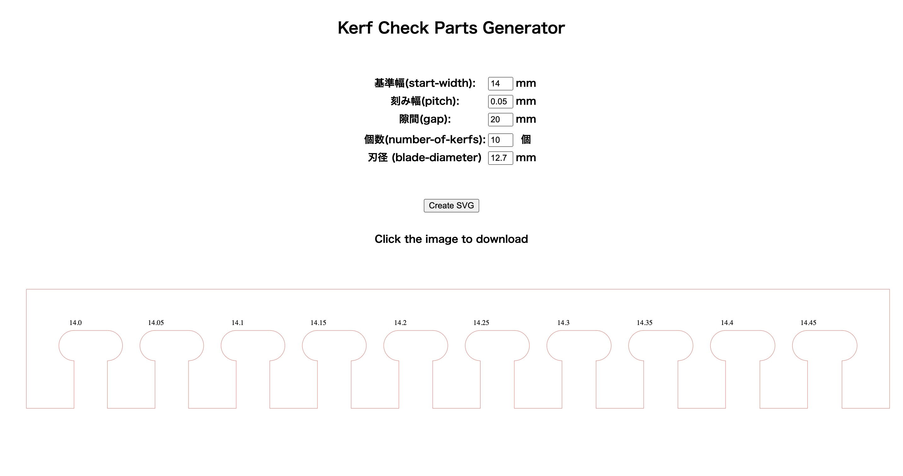
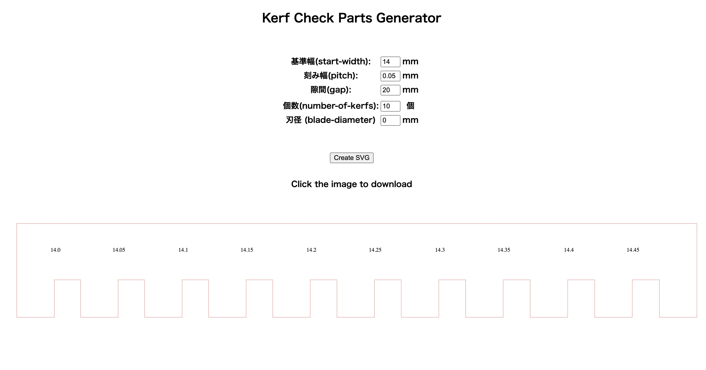
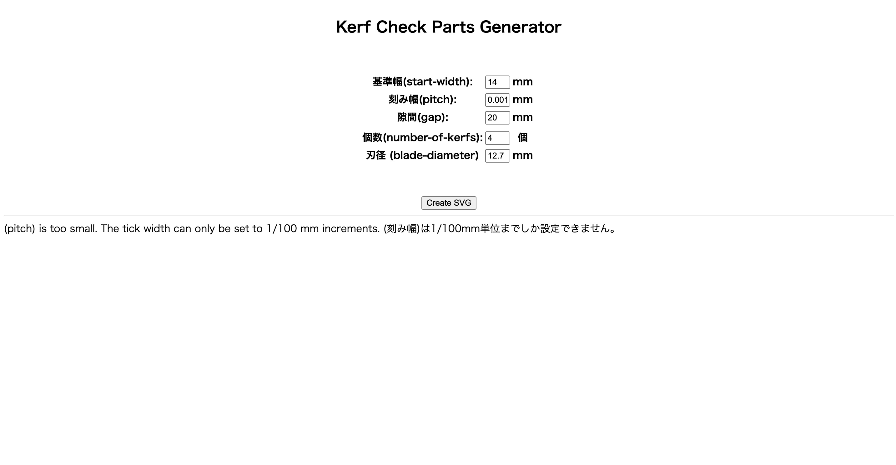

# Kerf Check Parts Generator

## Example



- You can create a kerf checker by entering five parameters ((start-width),(pitch), (gap),(number-of-kerfs), (blade-diameter)).

- By clicking on the "createSVG" button, you can display the image on the screen.
Click on the image to download it.




- By setting "blade diameter" to 0, the "T-bone fillet" can be eliminated on the laser cutting machine, which can be used for kerf checking on the laser cutter.



- (pitch) can only be set to 1/100 mm increments. 


## Local setting

### pip install
```bash
pip install -r requirements.txt
```

### Start Server
```bash
FLASK_APP=index.py flask run
```